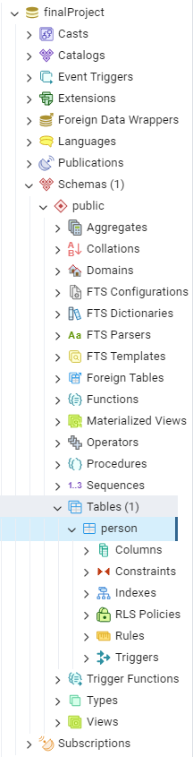

# Final Project - IT Factory Course

This project is a small application that is meant to manage a database filled with users. 
The application is created using the SprinBoot framework and uses Postman in order to test the API.

## Table of Contents

- [Installation](#installation)
- [Usage](#usage)

## Installation

1. Clone the repository.
2. Under pom.xml add the following dependencies: <To be filled>
3. Under src->main->resources->application.properties complete the following fields: <To be filled>

## Usage

Make sure you have both Postman and pgAdmin opened.
Please follow this steps in order an read the entire sentence before proceeding. Thank you!

1. Run the main application under src->main->java->com.itfactory->JavaFinalProject.
After this step, we should see the table created in pgAdmin, under the Tables tab, like the screenshot below.

2. In Postman we can create the following POST Request: http://localhost:9099/persons/addPerson
In the Body of the request, we can switch the input to raw and Json as the picture below <To be filled>

3. In the body of the request we add the following text, and then we send the request in order to create the first person.

{
"firstName":"Ion",
"lastName":"Mihai",
"emailPerson":"IonMihai@test.com",
"agePerson":22
}

We can then fill the body with the following text to create the second person:

{
"firstName":"Alex",
"lastName":"Marian",
"emailPerson":"AlexMarian@test.com",
"agePerson":26
}

And finally, insert this text to create the third person:

{
"firstName":"Andrei",
"lastName":"Vasile",
"emailPerson":"AndreiVasile@test.com",
"agePerson":30
}

Now we have 3 persons in out database.

4. In order to see our database with the persons that we added in the previous steps, 
we create a GET request with the following line: http://localhost:9099/persons/getPersonList

5. We can also check a specific person using their ID. In order to do this, we create a new GET request with the following line: http://localhost:9099/persons/1
The first person that we added should be returned to us as seen in this screenshot.

6. Moving forward, we will proceed to modify the last name of the third person we added.
In order to do this, we will create a Patch request with the following line: http://localhost:9099/persons/3
In the body of the request we can add the following raw Text "Gheorghe" as seen in this picture:

We should see the last name changed an get the status 200 OK like this snip here.

7. Now we will modify the e-mail address of this person. To do that, we create another Patch request with this code: http://localhost:9099/persons/email/3
In the body we add the following raw text "AndreiGheorghe@test.com".

We should see the e-mail changed.

8. Finally, we can also delete a person by ID, so we will proceed deleting the person with ID 3.
To do this, we create a new Delete request with this line http://localhost:9099/persons/3.
We should get 204 No Content status.

9. Now we can switch back to IntelliJ and under src->test->java->com.itfactory->JavaFinalProjectTests, we can run all tests as can be seen below.
If you followed all steps above in the order, we should have all 7 tests passed.
